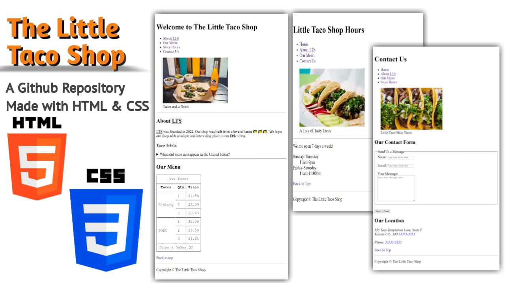

# The Little Taco Shop
  
Welcome to the repository of "Little Taco Shop" wesbite.

## Demo Screenshot

## Live Demo

* You can check out the live demo of the project here [The Little Taco Shop](https://premkrrajbhar.github.io/taco-project/)

## Table of Contents
1. [Project Overview](#project-overview)
2. [Description](#description)
3. [Features](#features)
4. [Technologies Used](#technologies-used)
5. [Usage](#usage)
6. [Contributing](#contributing)
7. [Contact](#contact)

## Project Overview

This project consists of a static website that provides information about a local taco shop, including its menu, store hours and contact details.

## Description 

This project includes three HTML documents 

1. **index.html** : The Home page for the "Little Taco Shop" that includes:
- A header with a navigation links.
- An image and caption of tacos.
- Section about history of taco with the help of `details` tag and `summary` HTML tags, so when you click  this ▶ icon so it will expand and show little bit of history of tacos.
- Sections about tacos menu.
- A responsive table by using [Media Query](https://en.wikipedia.org/wiki/Media_queries) showcasing the taco menu. 

2. **store.html** : The sub page of "Little Taco Shop" that contain details of the shop hours:
- A header with a navigation links.
- An image and caption of taco tray.
- Information about operating hours of shop.

3. **contact.html** : Another sub page of "Little Taco Shop" that contain contact information of the shop:
- A header details with a navigation links.
- An image and caption of taco.
- A contact form for sending messages and the messages will goes to [httpbin.org](https://httpbin.org/), A simple HTTP Request & Response Service.
- Location and Contact details.

**Note** : The HTML documents of this project have been validated using the [W3C Markup Validation Service](https://validator.w3.org/). This ensures that the code adheres to web standards and is free of syntax errors.

## Features 

- **Responsive Design** : The site is desigmed to be responsive and adjust to different screen sizes.
- **Navigation** : Each pages includes a navigation menu to easily access other pages within the site.
- **Better SEO** : The site focus on better Search Engine Optimization (SEO) so the search engines ranks the site in the top.
- **Store Hours Page** : Details about operating hours of the shop.
- **Contact Us Page** : Contact form for user inquires and address and phone number for contacting the shop.

## Technologies Used 

- **HTML5** : Structuring the content.
- **CSS3** : Styling the webpage and ensuring responsiveness.
- **Meta Tags** : To index webpage in search engines.
- **httpbin.org** : To send input of contact us page to check HTML form.
- **IDE** : Visual Studio Code

## Usage

- Once the project is set up, open the `index.html` file in any modern web browser to view the webpage.
- To view other pages, navigate through the site's navigation links or directly open `store.html` or `contact.html`.

## Contributing

- If you have suggestions for improvements or bug fixes, feel free to create a pull request or open an issue.

## Contact

For any questions or comments, please reach out to :
- Email : [premkumar224487@gmail.com](mailto:premkumar224487@gmail.com)
- Github : [premkrrajbhar](https://github.com/premkrrajbhar)

